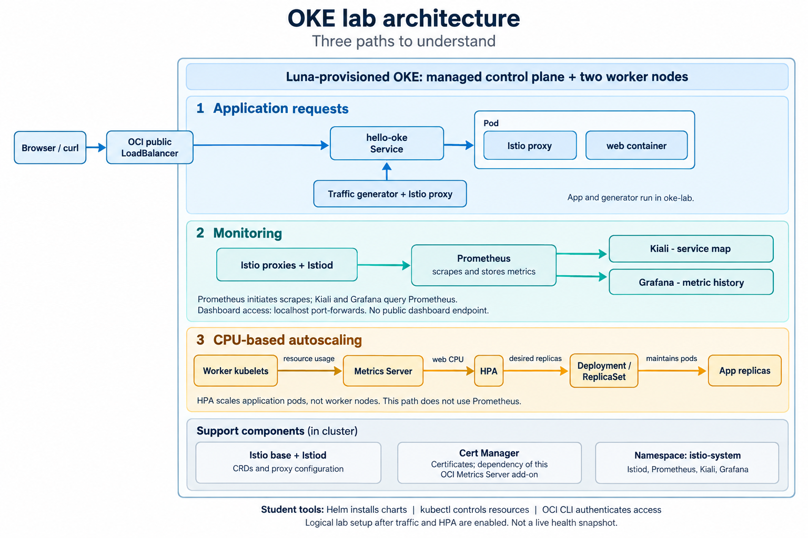

# OKE Bootcamp: Build, Run, and Scale Kubernetes on OCI

Luna provisions your Oracle Kubernetes Engine (OKE) cluster automatically. Use Helm, a package manager for Kubernetes, to install and configure your application and monitoring tools. Istio manages application traffic and reports request metrics; Prometheus collects and stores those metrics; Kiali maps service traffic and health; and Grafana charts metrics over time.

Generate traffic, compare request rates and latency, and observe manual scaling and CPU-based autoscaling. Optionally, replace one application pod and watch Kubernetes restore the replica count. This is a **60-minute hands-on lab and debrief**, following a 30-minute lecture while the cluster provisions (**90 minutes total**). Cluster creation and manual resource cleanup are not student exercises.

This lab assumes you can navigate a terminal, copy commands, and edit a YAML value. By the end, you should be able to:

- Customize and deploy an application with Helm, then explain how its Service reaches its pods.
- Identify the application container and its Istio proxy, and follow traffic in Kiali.
- Compare baseline and load metrics in Grafana using recorded evidence.
- Explain manual scaling, CPU-driven autoscaling, and why neither adds worker nodes in this lab.
- Distinguish readiness from liveness and use pod events to investigate a health warning.

Run commands in a **Bash terminal on the Luna desktop**. Keep session credentials private.

Materials revision: `lab-2026-09-22.2`. Your checkout and Luna instructions must show this same revision. During each prediction prompt, take 30 seconds to state your answer before continuing; use the following command output to explain whether your prediction held. These pauses are included in the exercise times.

[Download the completion sheet (PDF)](docs/completion-sheet.pdf) for the lab checkpoints. If it opens in your browser, use the PDF viewer's download button to save a copy. You can print it or use the [Markdown version](docs/completion-sheet.md) in your own notes.



The diagram shows the documented setup after traffic and autoscaling are enabled, not a live health snapshot. [Open the full-size PNG](docs/images/oke-lab-architecture.png) or read the [component ownership and vocabulary](docs/architecture.md).

## Schedule

| Approximate hands-on minutes | Exercise | What you will demonstrate |
|---|---|---|
| 0–5 | 1. Connect | Verify your assigned cluster and resource metrics |
| 5–23 | 2. Install mesh and monitoring | Install Istio, Prometheus, Kiali, and Grafana with Helm |
| 23–33 | 3. Build and run | Customize and deploy two replicas with an OCI LoadBalancer |
| 33–40 | 4. Observe traffic | Interpret the Kiali graph and Grafana baseline |
| 40–55 | 5. Scale | Scale manually, then observe CPU-driven scale-out and scale-in |
| 55–60 | 7. Debrief and buffer | Explain your observations and absorb delays |

Step 6, pod recovery, is optional: do it only if step 5 is complete by minute 50. Preserve the last five minutes for debrief and delays. Direct Prometheus exploration, controlled outages, and OCI alarms are extension activities outside this hour.

Times are **planning targets, not guaranteed completion times**, counted from the start of hands-on work after the 30-minute lecture. They include reading, editing, commands, waits, and interpretation. Downloads and cloud readiness vary; ask for help when a checkpoint is blocked. The cluster must be ready before hands-on work starts.

## 1. Connect to your prepared cluster — 5 minutes

Open your assigned Luna session as directed by the instructor. The desktop can appear before the cluster is ready. If provisioning is still running or has failed, ask the instructor; do not create a replacement cluster.

In **terminal 1** on your Luna desktop, download the lab repository:

```bash
git clone --branch lab-2026-09-22.2 --single-branch \
  https://github.com/chiphwang1/AI_world_lab.git "$HOME/oke-bootcamp" &&
  cd "$HOME/oke-bootcamp"
```

### Find your lab login and compartment

Obtain your own kubeconfig using your temporary Luna account. Complete this setup during the lecture demonstration where possible, once your cluster is ready.

1. On your running Luna virtual desktop, double-click the **Luna Lab** icon.
2. On the Luna Lab page, click the **OCI Console** quick link. Sign in using the temporary username and password shown under **Credentials**. Keep these credentials private; do not paste them into terminal commands, screenshots, or Git files.
3. Return to the Luna Lab page and open **Oracle Cloud**. Find **Compartment Name** and note it for the cluster selection below. You do not need to inspect Terraform logs to find your login or compartment.

If the icon, quick link, credentials, or compartment information is missing, stop and ask the instructor to check your Luna session. Do not substitute a personal account or another learner's credentials. Oracle documents this flow in its [Luna login and compartment instructions](https://docs.oracle.com/en/learn/build-cloud-native-java-applications-with-micronaut-and-graalvm/lab1/configure-db-access.html); only the login steps apply here, not that tutorial's database exercises.

### Open your own cluster in the OCI Console

1. In the OCI Console, select your assigned **region** and open **Kubernetes Clusters (OKE)**.
2. In the compartment selector, choose the **Compartment Name** shown for your Luna session.
3. Click **your assigned cluster's name** to open its details page. Compare its name and OCID with the instructor's assignment before continuing. If the cluster is absent, still provisioning, or ambiguous, ask for help; do not choose another cluster.

   **Example page only—not a shared student cluster:** [OKE cluster details in Phoenix](https://cloud.oracle.com/containers/clusters/ocid1.cluster.oc1.phx.aaaaaaaa5mwgyqarbllvk7xavr2qkvipop7ihd6i4i5vejaoxctcyaybtyaq?region=us-phoenix-1). This link identifies one specific cluster. Use the equivalent page for **your own cluster**, not the example's OCID. Your region may also differ.

   Your cluster details URL has this form; replace both placeholders if constructing it manually:

   ```text
   https://cloud.oracle.com/containers/clusters/<your-cluster-ocid>?region=<your-region>
   ```

4. On your cluster's details page, open **Actions → Access cluster → Local Access**. “Local” means the terminal on your Luna desktop, not your personal laptop.
5. In **terminal 1**, run `umask 077` and `mkdir -p "$HOME/.kube"`.
6. Copy and **run** the displayed `oci ce cluster create-kubeconfig` command in terminal 1 to create your kubeconfig. Change `--file` to `"$HOME/.kube/oke-lab"`; keep **your cluster's** OCID, region, and endpoint. Use the [desktop OCI authentication settings](docs/cluster-access.md#generate-your-kubeconfig-on-the-desktop). Do not add `--overwrite`.

### Verify your kubeconfig

```bash
export KUBECONFIG="$HOME/.kube/oke-lab"
ls -l "$KUBECONFIG" &&
test -s "$KUBECONFIG" &&
kubectl config get-contexts &&
kubectl config current-context
```

### Check cluster readiness

The walkthrough uses `~/.kube/oke-lab`; substitute the instructor's path **in every terminal** if yours differs. Replace `<instructor-assigned-context>` below with the exact name supplied by the instructor, keeping the quotes:

```bash
export KUBECONFIG="$HOME/.kube/oke-lab"
bash scripts/check-ready.sh --context '<instructor-assigned-context>'
```

This read-only check verifies files, tool availability, the assigned context, API access, version compatibility, two Ready workers, and resource metrics. OCI CLI is still required: the kubeconfig uses it to generate authentication tokens. The script never selects a context or installs anything.

Expected output includes these lines, followed by numeric CPU/memory readings; actual values vary:

```text
PASS Workers: 2/2 Ready and not cordoned
PASS Resource metrics: numeric CPU and memory for both workers
```

Continue only after `Preflight passed`. On `FAIL`, follow its message or ask the instructor; see [preflight troubleshooting](https://luna.oracle.com/lab/8f468598-9993-41b8-92ce-e643f5603f9b/steps#preflight-fails). Never use a shared or production cluster. The instructor verifies Helm install permissions separately.

Load the pinned chart versions into terminal 1 and check the prepared archives. This check reads local files; it does not download or install anything:

```bash
source helm/versions.env
bash scripts/prepare-charts.sh --check
```

Expect five `PASS Prepared chart` lines. If a chart is missing or mismatched, ask the instructor to finish preparation. Keep terminal 1 in this directory for lab commands. The Git tag pins the lab files; `helm/versions.env` pins the upstream charts.

**Checkpoint:** confirm the assigned context, two Ready nodes, numeric CPU readings, and available lab files. Explain which file selects your Kubernetes connection and which component supplies CPU metrics.

Run from the repository root in terminal 1. Replace the placeholder with your assigned context. The `&&` operators stop subsequent commands if a check fails; the preflight verifies the assignment before contacting the cluster.

```bash
export KUBECONFIG="$HOME/.kube/oke-lab"
LAB_CONTEXT='<instructor-assigned-context>'
printf 'Kubeconfig: %s\n' "$KUBECONFIG"
kubectl config current-context &&
bash scripts/check-ready.sh --context "$LAB_CONTEXT" &&
kubectl --context "$LAB_CONTEXT" --request-timeout=15s get nodes &&
kubectl --context "$LAB_CONTEXT" --request-timeout=15s top nodes &&
ls -ld README.md charts helm scripts &&
bash scripts/prepare-charts.sh --check
```

Expect `Preflight passed`, two node rows showing `Ready`, numeric CPU/memory readings for both nodes, the four lab paths, and five `PASS Prepared chart` lines. Stop and ask for help on any failure. A CPU reading such as `125m` means 0.125 CPU core, not a required target.

**Explain:** `KUBECONFIG` points to `~/.kube/oke-lab`; the selected context inside that file identifies the cluster and user. Metrics Server supplies the resource metrics used by `kubectl top` and this lab's HPA; Prometheus supplies the dashboard metrics. See [kubectl top node](https://kubernetes.io/docs/reference/kubectl/generated/kubectl_top/kubectl_top_node/).

## 2. Install Istio, Prometheus, Kiali, and Grafana — 18 minutes

### What the tools do

| Tool or component | Purpose in this lab | Setup |
|---|---|---|
| Helm | Installs and upgrades Kubernetes resources packaged as charts. | Already on the desktop |
| Istio | Adds proxies beside app containers to manage traffic and report request metrics. | You install it below |
| Prometheus | Collects and stores metrics from Istio for the dashboards to query. | You install it below |
| Kiali | Draws a map of service traffic and shows request rates, errors, latency, and workload health. | You install it below |
| Grafana | Displays metric history in dashboards so you can compare baseline traffic, load, and scaling. | You install it below |
| Metrics Server | Supplies CPU and memory readings to `kubectl top` and CPU metrics to this lab's HPA. | Provided with the cluster |
| Cert Manager | Manages TLS certificates; it is a dependency of this OCI-managed Metrics Server add-on. | Provided with the cluster |
| HPA | Adjusts app replicas using CPU metrics; it does not add worker nodes. | You enable it in step 5 |

`kubectl` inspects and controls Kubernetes resources. OCI CLI authenticates your Kubernetes connection. Both are already on the desktop. Prometheus supplies dashboard data; Metrics Server supplies this HPA's CPU input. See the [architecture diagram](docs/architecture.md) for the two paths.

### Install Istio

This lab uses **sidecar mode**: Istio adds a proxy beside each application container. The preflight checks the pinned release's Kubernetes compatibility.

Helm's `--install` creates a release if it is absent; `upgrade` updates it if present. `-f` supplies lab settings, and `--wait` waits for readiness. The `.tgz` files are instructor-downloaded charts; you still install every release yourself. Worker nodes may still need to pull container images. Install Istio base first because it registers custom resource definitions (CRDs), the extra Kubernetes object types Istio uses. `istiod` is its control plane. While commands wait, trace the metrics path on the [architecture diagram](docs/architecture.md).

```bash
helm upgrade --install istio-base ".lab-cache/charts/base-${ISTIO_VERSION}.tgz" \
  --namespace istio-system --create-namespace \
  --set defaultRevision=default --wait --timeout 10m
helm upgrade --install istiod ".lab-cache/charts/istiod-${ISTIO_VERSION}.tgz" \
  --namespace istio-system \
  -f helm/values/istiod.yaml --wait --timeout 10m
kubectl -n istio-system rollout status deployment/istiod --timeout=300s

kubectl create namespace oke-lab --dry-run=client -o yaml | kubectl apply -f -
kubectl label namespace oke-lab istio-injection=enabled --overwrite
```

Namespace labeling enables injection for **new pods**. Do not label `istio-system` for injection.

### Install Prometheus

Prometheus collects Istio request metrics. Install it before Kiali and Grafana, which query its data. This lab uses temporary storage, so replacing the Prometheus pod loses metric history.

```bash
helm upgrade --install prometheus ".lab-cache/charts/prometheus-${PROMETHEUS_CHART_VERSION}.tgz" \
  --namespace istio-system \
  -f helm/values/prometheus.yaml --wait --timeout 10m
```

Wait for this command to finish successfully before continuing.

### Install Kiali

Kiali uses Prometheus data to show which services communicate and how their requests behave. The lab values point Kiali to the Prometheus instance you just installed.

```bash
helm upgrade --install kiali-server ".lab-cache/charts/kiali-server-${KIALI_CHART_VERSION}.tgz" \
  --namespace istio-system \
  -f helm/values/kiali.yaml --wait --timeout 10m
```

You will open Kiali and inspect the traffic graph in step 4, after the app and traffic generator are running.

### Install Grafana

Grafana uses the same Prometheus data to plot traffic and scaling over time. The command below installs the dashboard and data source from the lab files. All three monitoring tools remain internal to the cluster, with no persistent telemetry volumes.

```bash
helm upgrade --install grafana ".lab-cache/charts/grafana-${GRAFANA_CHART_VERSION}.tgz" \
  --namespace istio-system \
  -f helm/values/grafana.yaml \
  --set-file dashboards.default.oke-lab.json=helm/dashboards/oke-lab.json \
  --wait --timeout 10m
helm list --namespace istio-system
kubectl -n istio-system get pods,svc
```

Kiali and Grafana use read-only, anonymous access for this dedicated training cluster. **Never expose them with a public LoadBalancer or Ingress.** Anyone with network access to their Services can read/query lab metrics; production requires authenticated access and appropriate network controls. Grafana's data source and dashboard are provisioned by Helm, so there is no manual import or administrator login step. Ignore the Grafana chart's generic administrator-password/login instructions printed after installation; use the Viewer URL in step 4.

**Checkpoint:** all five releases (`istio-base`, `istiod`, `prometheus`, `kiali-server`, and `grafana`) are deployed and their workload pods are ready. Explain why Istio base precedes istiod and why Prometheus is needed alongside Grafana. Traffic panels will be empty until the application and generator run. If an installation is blocked, ask the instructor for help before continuing.

## 3. Build and run the application — 10 minutes

Open `helm/values/student.yaml` in the desktop editor and customize `message`, for example:

```yaml
message: "Hello from YOUR-NAME's OKE lab"
```

Replace `YOUR-NAME` with your name and save the file. Leave `replicaCount: 2` and the resource settings unchanged. Here, **build** means configuring the Kubernetes deployment; the chart supplies a small Python application and its runtime. No image registry account is required.

Check the chart, then install the application:

```bash
helm lint ./charts/oke-mesh-app -f helm/values/student.yaml --strict
helm upgrade --install hello-oke ./charts/oke-mesh-app \
  --namespace oke-lab -f helm/values/student.yaml --wait --timeout 10m
kubectl -n oke-lab get deploy,pods,svc
kubectl -n oke-lab get pods -l app=hello-oke \
  -o jsonpath='{range .items[*]}{.metadata.name}{": containers="}{.spec.containers[*].name}{"; init/sidecars="}{.spec.initContainers[*].name}{"\n"}{end}'
```

Expect two application replicas with an `istio-proxy` beside the `web` container, normally showing `2/2` containers ready. In this pinned setup, Istio uses a native sidecar: `istio-proxy` appears under `init/sidecars` but keeps running alongside `web`; `istio-init` is a separate setup container that completes. Do not also apply the legacy `kubernetes/` manifests; they use the same application name but are not Helm-managed.

To verify the replicas and inspect both pods without changing them, use the assigned context from step 1:

```bash
kubectl --context "$LAB_CONTEXT" -n oke-lab rollout status deployment/hello-oke --timeout=300s &&
kubectl --context "$LAB_CONTEXT" -n oke-lab get deployment hello-oke &&
kubectl --context "$LAB_CONTEXT" -n oke-lab get pods -l app=hello-oke

kubectl --context "$LAB_CONTEXT" -n oke-lab get pods -l app=hello-oke \
  -o 'jsonpath={range .items[*]}{.metadata.name}{"\n  app containers: "}{.spec.containers[*].name}{"\n  init/sidecars: "}{.spec.initContainers[*].name}{"\n"}{end}'

kubectl --context "$LAB_CONTEXT" -n oke-lab describe pods -l app=hello-oke
```

Expect Deployment `READY` to be `2/2` and two application pods, normally each `2/2 Running`. In each pod's description, look for `web` under **Containers** with `State: Running` and `Ready: True`; `istio-proxy` under **Init Containers** with `State: Running` and `Ready: True`; and `istio-init` with `State: Terminated`, `Reason: Completed`, and `Exit Code: 0`. The next command confirms the native sidecar's per-container restart policy:

```bash
kubectl --context "$LAB_CONTEXT" -n oke-lab get pods -l app=hello-oke \
  -o 'jsonpath={range .items[*]}{.metadata.name}{": istio-proxy restartPolicy="}{.spec.initContainers[?(@.name=="istio-proxy")].restartPolicy}{"\n"}{end}'
```

Expect `Always` for both pods. A native sidecar remains running despite being listed under init containers; an ordinary init container completes before the application starts. See [Kubernetes sidecar containers](https://kubernetes.io/docs/concepts/workloads/pods/sidecar-containers/). If these checks differ, ask the instructor; do not apply the legacy manifests or reinstall components merely to match the example.

The Service requests one OCI LoadBalancer. Get its public IP, save it in `APP_IP` for later commands, and display it:

```bash
APP_IP=$(kubectl -n oke-lab get svc hello-oke -o jsonpath='{.status.loadBalancer.ingress[0].ip}')
echo "$APP_IP"
```

If the output is blank, check `kubectl -n oke-lab get svc hello-oke`; `EXTERNAL-IP` may still show `<pending>`. Wait 30 seconds and rerun both commands above. Ask the instructor if no IP appears after three minutes. Continue only when `APP_IP` contains an IP address.

Test the application in the same terminal:

```bash
curl --fail --max-time 10 "http://${APP_IP}/"
```

Expected response (illustrative; your message and pod name will differ):

```json
{"message":"Hello from YOUR-NAME's OKE lab","pod":"hello-oke-example-abc12","work":false}
```

You can also open `http://<EXTERNAL-IP>/` in the desktop browser. An assigned IP can appear before OCI considers the backends healthy; if HTTP initially fails, wait 15–30 seconds and retry. If it still fails after a minute, ask the instructor and see [troubleshooting](docs/troubleshooting.md). The endpoint is public and unauthenticated: use only training data, not secrets.

Enable baseline traffic so metrics can accumulate before you open Kiali and Grafana:

```bash
helm upgrade hello-oke ./charts/oke-mesh-app --namespace oke-lab \
  --reuse-values --set traffic.enabled=true --wait --timeout 10m
kubectl -n oke-lab logs -l app=hello-oke-traffic -c traffic --prefix --timestamps --tail=10
```

The traffic generator makes one request approximately every two seconds. Leave it running during the exercise so Kiali can show a client-to-service edge.

**Checkpoint:** your customized message is returned, two app replicas are ready, and the generator is running. Identify the `web` and `istio-proxy` containers. Predict whether replacing a pod would require a new Service IP. Ask for help if HTTP or traffic is still failing at this checkpoint.

## 4. Explore traffic in Kiali and Grafana — 7 minutes

Keep **terminal 1** for commands, **terminal 2** for the Kiali port-forward, and **terminal 3** for the Grafana port-forward. Use the same kubeconfig path in each. Open the forwards while baseline traffic accumulates.

### Kiali: service-to-service traffic

In **terminal 2** on the same Luna desktop:

```bash
export KUBECONFIG="$HOME/.kube/oke-lab"
kubectl -n istio-system port-forward --address 127.0.0.1 svc/kiali 20001:20001
```

Open **http://localhost:20001/kiali** in the browser **inside that desktop**. Your laptop's localhost is different. Keep the terminal running; do not bind to `0.0.0.0`.

Select namespace `oke-lab`, open the traffic graph, choose a recent time range (such as last five minutes), and enable refresh. Allow a minute or two for metrics. Find `hello-oke-traffic → hello-oke` and inspect request rate, success rate, and latency. Kiali visualizes traffic; the application's response is at the LoadBalancer URL.

If Kiali shows **Degraded**, see [Kiali health warnings in Appendix A](https://luna.oracle.com/lab/8f468598-9993-41b8-92ce-e643f5603f9b/steps#kiali-health-warnings).

### Grafana: metrics over time

Leave the Kiali port-forward running. In **terminal 3** on the same desktop:

```bash
export KUBECONFIG="$HOME/.kube/oke-lab"
kubectl -n istio-system port-forward --address 127.0.0.1 svc/grafana 13000:80
```

Open **http://127.0.0.1:13000/d/oke-lab** in the desktop browser. No login is needed for Viewer access. Keep both port-forward terminals open and use the first terminal for lab commands. If a dashboard stops opening or you see `address already in use`, follow [port-forward troubleshooting](https://luna.oracle.com/lab/8f468598-9993-41b8-92ce-e643f5603f9b/steps#troubleshooting-dashboard-port-forwards).

The **OKE Lab — Traffic & Scaling** dashboard opens with a 30-minute range and 15-second refresh. At baseline, look for:

- **Requests / second:** approximately 0.5 from the traffic generator.
- **Successful requests:** near 100% for healthy traffic; it counts HTTP 2xx/3xx responses.
- **Application proxies up:** two successfully scraped application proxies, excluding the generator.
- **Istiod scrape health:** `1` means Prometheus can scrape Istiod; this is not a complete control-plane health check.
- **Traffic, latency, response codes, and proxy-count graphs:** history to compare with the upcoming load burst.

The proxy-count panel is a scaling indicator, **not HPA desired replicas or pod readiness**. Scrape discovery can lag pod changes. Check `kubectl -n oke-lab get hpa hello-oke` and `kubectl -n oke-lab get pods -l app=hello-oke` for replica/health status. The HPA does not exist until step 5 enables it. Missing data does not mean zero traffic or a healthy system; see [troubleshooting](docs/troubleshooting.md).

**Checkpoint:** find `hello-oke-traffic → hello-oke` in Kiali and record the Grafana baseline request rate, success rate, latency, and proxy count. Keep both dashboards open for scaling. The [monitoring guide](docs/monitoring.md) explains the underlying Prometheus queries and optional exercises.

Fill the baseline row on your [completion sheet (PDF)](docs/completion-sheet.pdf) now and the other rows in step 5. Use the same Grafana time range and p95 latency statistic; write `no data` if a panel is empty.

Pause and explain your baseline to a partner or instructor: point to the traffic edge in Kiali and one Grafana reading, then name the component that supplies both views. Use the values you observed, including `no data` when appropriate. If the panels remain empty after two minutes of traffic, use the troubleshooting guide with the instructor.

## 5. Scale manually and automatically — 15 minutes

Return to **terminal 1 at the repository root**, using your verified lab context; leave both port-forwards running. For a new terminal, see [fresh-terminal setup in Appendix A](https://luna.oracle.com/lab/8f468598-9993-41b8-92ce-e643f5603f9b/steps#fresh-terminal-setup-errors).

### Scale manually

Before running this, predict which will change: app pod count, worker node count, Service IP. State all three predictions to a partner or jot them beside question 3 on your completion sheet. Then increase the application from two to four replicas:

```bash
helm upgrade hello-oke ./charts/oke-mesh-app --namespace oke-lab \
  --reuse-values --set replicaCount=4 --wait --timeout 10m
kubectl -n oke-lab get pods -l app=hello-oke -o wide
kubectl -n oke-lab get deployment hello-oke
kubectl get nodes
kubectl -n oke-lab get svc hello-oke
for request in {1..10}; do curl --fail --max-time 10 "http://${APP_IP}/"; done
```

Before reading the explanation below, point to the replica count, worker count, Service IP, and returned pod names in your output. Compare them with your starting observations. Which values support or contradict your prediction?

Compare your explanation: the expected result is four ready app replicas, the same Service IP, and the same two workers. Responses may show different pod names, but equal distribution across a short sequence is not guaranteed.

**Learning check: Running is not the same as Ready.** Read this while the Helm upgrade waits; no extra deployment or deliberate failure is needed. A new pod's app or Istio proxy may still be initializing. In this lab, `2/2` means both are ready.

| Probe | Question it answers | What a failed check does after its failure threshold |
|---|---|---|
| Readiness | Can this container accept traffic now? | Marks the pod not Ready, keeping it out of normal Service traffic; does not restart the container. |
| Liveness | Does this container need restarting? | Triggers a restart of the failing container, not replacement of the whole Deployment. |

The [app chart](charts/oke-mesh-app/templates/application.yaml) checks `/healthz` for both probes; liveness starts after a 10-second initial delay. Inspect the `READY` and `RESTARTS` columns above. Could a pod be `Running` but not ready, with zero restarts? Explain your answer before discussing it with the instructor. Use question 5 on your completion sheet; the [Kubernetes probe guide](https://kubernetes.io/docs/concepts/workloads/pods/probes/) is a reference after your prediction.

For persistent Kiali warnings, use [Appendix A](https://luna.oracle.com/lab/8f468598-9993-41b8-92ce-e643f5603f9b/steps#kiali-health-warnings).

Restore the starting size before enabling the HPA:

```bash
helm upgrade hello-oke ./charts/oke-mesh-app --namespace oke-lab \
  --reuse-values --set replicaCount=2 --wait --timeout 10m
```

### Enable CPU autoscaling

First verify the cluster's resource metrics:

```bash
kubectl top nodes
kubectl -n oke-lab top pods --containers
```

If metrics are unavailable, stop here and ask the instructor to check Metrics Server. **The Prometheus used by Kiali and Grafana does not supply this HPA's CPU metrics.**

```bash
helm upgrade hello-oke ./charts/oke-mesh-app --namespace oke-lab \
  --reuse-values --set autoscaling.enabled=true --wait --timeout 10m
kubectl -n oke-lab get hpa hello-oke
kubectl -n oke-lab describe hpa hello-oke
```

Expected `get hpa` output once baseline metrics are available (illustrative; age and CPU vary):

```text
NAME        REFERENCE              TARGETS       MINPODS   MAXPODS   REPLICAS   AGE
hello-oke   Deployment/hello-oke    cpu: 1%/60%   2         6         2          1m
```

The HPA manages **2–6 application pods** and targets average CPU utilization of 60% of the `web` container's `100m` request, equivalent to `60m` per pod. It excludes the Istio sidecar's CPU. `100m` is one tenth of a CPU; the request is used for scheduling and HPA utilization, while the `250m` CPU limit caps the container's CPU use.

Before generating load, rerun `kubectl -n oke-lab get hpa hello-oke` and `kubectl -n oke-lab describe hpa hello-oke` until utilization is numeric and `ScalingActive=True`. Allow up to two minutes, then ask for help if metrics are still missing. A brief replica-count dip can occur when transferring ownership from Helm to the HPA; let it settle at two ready replicas. Do not manually scale the Deployment while the HPA owns its replica count.

**Predict:** if the CPU request were `200m` with the same 60% target, what CPU usage would correspond to that target? Write your calculation in the existing prediction field on the completion sheet, then compare reasoning with a partner or instructor. Keep the lab's resource settings unchanged.

### Generate a five-minute CPU load

The traffic generator sends two concurrent request streams to `/work`, then automatically returns to its low-rate `/` traffic after approximately five minutes. Aim to start by minute 47 so there is time to observe scale-in before minute 55. Run this only in your assigned lab cluster.

```bash
helm upgrade hello-oke ./charts/oke-mesh-app --namespace oke-lab \
  --reuse-values --set traffic.loadEnabled=true --wait --timeout 10m
kubectl -n oke-lab get hpa hello-oke --watch
# Observe CPU and replica changes for several minutes; Ctrl+C stops only the watch.
```

To inspect CPU and logs, press Ctrl+C in **terminal 1** to stop only the watch, then run:

```bash
kubectl -n oke-lab top pods --containers
kubectl -n oke-lab get pods -l app=hello-oke -o wide
kubectl -n oke-lab logs -l app=hello-oke-traffic -c traffic --prefix --timestamps --tail=10
```

Resume `kubectl -n oke-lab get hpa hello-oke --watch` in terminal 1 as needed; terminals 2 and 3 keep serving the dashboards. Use the traffic logs to identify when the burst finishes. During a rollout, logs can include both old and new traffic pods; the prefixes and timestamps identify which pod produced each line.

Watch Grafana's **Traffic through Istio**, **Request latency**, and **Application proxy count — scaling indicator** panels alongside the HPA watch. Record a load observation and the peak replica count. Check success rate/response codes and confirm the traffic edge remains visible in Kiali. The HPA should add pods when sustained CPU exceeds its target; the exact count depends on available CPU and demand, not a guaranteed six replicas. If pods stay Pending or utilization stays `<unknown>`, use [troubleshooting](docs/troubleshooting.md); do not enlarge the node pool.

The baseline calls `/`; the burst calls the more expensive `/work`. Two concurrent request streams produce a variable request rate. Differences between these phases show the response to this workload change; they do not isolate autoscaling's effect on latency. During the existing five-minute burst, take turns explaining which component supplies the HPA's CPU input and which supplies dashboard data. Point to a reading from each path rather than starting an extra experiment.

### Stop load and observe scale-in

Explicitly reset burst mode after the test (this also stops an active burst early):

```bash
helm upgrade hello-oke ./charts/oke-mesh-app --namespace oke-lab \
  --reuse-values --set traffic.loadEnabled=false --wait --timeout 10m
kubectl -n oke-lab get hpa hello-oke --watch
# Wait for CPU to settle and replicas to return to two, then press Ctrl+C.
# If this takes more than three minutes, stop the watch and ask the instructor.
```

This lab shortens the downscale stabilization window to 60 seconds; metrics collection and reconciliation add delay, so allow several minutes. Kubernetes normally defaults to a five-minute window. The burst timer starts again if the traffic pod restarts while burst mode is enabled; resetting the flag prevents another burst.

After scale-in, confirm two Ready app pods with `kubectl -n oke-lab get pods -l app=hello-oke`. Keep Grafana's range at **Last 30 minutes** to see the whole burst. Confirm request rate returns toward baseline and proxy count follows scale-in; the historical peak should remain visible. Prometheus retains two hours of data but loses it if its pod is replaced. Complete your observation table before ending the session. If scale-in remains blocked at minute 55, record the observed state and involve the instructor; do not mark the checkpoint complete.

**Checkpoint:** record initial, peak, and final HPA replica counts and compare them with Grafana's proxy-count graph. Before marking scale-in complete, show the instructor or a partner the HPA count and two Ready app pods. Explain any lag in the graph using your observations. Finish questions 2–4 on the completion sheet during this existing wait. See the [Kubernetes HPA guide](https://kubernetes.io/docs/concepts/workloads/autoscaling/horizontal-pod-autoscale/) for the metric and stabilization behavior.

## 6. Optional: observe pod recovery — 5 minutes

Do this only if step 5 is complete by minute 50, leaving five minutes for recovery and five for debrief. Otherwise, skip to step 7. Leave baseline traffic running. Predict whether deleting one pod changes the desired replica count, then delete **one application pod**, not the Deployment:

```bash
POD_TO_REPLACE=$(kubectl -n oke-lab get pods -l app=hello-oke -o jsonpath='{.items[0].metadata.name}')
kubectl -n oke-lab delete pod "$POD_TO_REPLACE"
kubectl -n oke-lab get pods -l app=hello-oke --watch
# Press Ctrl+C once a replacement pod is Ready.
kubectl -n oke-lab rollout status deployment/hello-oke --timeout=300s
curl --fail --max-time 10 "http://${APP_IP}/"
kubectl -n oke-lab get events --sort-by=.lastTimestamp
```

**Checkpoint:** identify the replacement's new name. The Deployment's ReplicaSet restores the desired number of pods; this is self-healing, not an HPA scale-out. The Service IP stays the same. Inspect Kiali for any transient errors; deleting one of several healthy replicas need not cause a visible outage.

## 7. Finish the lab

You are finished when you have deployed your customized application, observed the Kiali traffic graph and Grafana metrics, and seen replicas increase and decrease with demand. Stop local watches and both dashboard port-forwards with Ctrl+C when you no longer need them. This does not uninstall the dashboards or stop the in-cluster traffic generator; burst mode must already be disabled in step 5.

Check your final release settings:

```bash
helm get values hello-oke --namespace oke-lab
```

Under `traffic`, confirm `loadEnabled: false`. The baseline generator remains enabled. Use your last five minutes to complete the [completion sheet and debrief questions (PDF)](docs/completion-sheet.pdf) with a partner or instructor. Keep your readings and peak replica count; record any blocked checkpoint rather than marking it complete.

**No manual resource cleanup is required from students.** Leave the application and Helm releases installed. Luna starts automated resource cleanup when the session ends or expires. Stopping CPU load in step 5 is part of observing scale-in, not a cleanup task.

## Appendix A: Troubleshooting

Use only the section that matches your symptom, then return to the lab step where you stopped. Appendix links open the Luna Lab Steps page. If reading this file locally, scroll to the named heading below. These checks are not additional required exercises. For other issues, see the [full troubleshooting guide](docs/troubleshooting.md).

### Preflight fails

Read the first `FAIL` line and correct that condition before rerunning the same command. The check stops at the first failure; it does not repair your environment.

- Missing repository files: return to the checkout root or ask for the complete checkout.
- Missing tool or unsupported kubectl version: ask the instructor to check the actual Bash `PATH`; do not run `scripts/ci-tools.sh` on the desktop.
- Missing kubeconfig, wrong context, or authentication failure: follow [cluster access](docs/cluster-access.md#verify-the-selected-file-and-context). Do not change the expected context just to make the check pass.
- Workers or resource metrics not ready: ask the instructor to check provisioning and the managed Metrics Server add-on. Do not resize the node pool or reinstall add-ons.

### Fresh-terminal setup errors

If you opened a fresh terminal, change into your existing repository checkout and repeat step 1's kubeconfig/OCI environment setup before continuing. Verify `kubectl config current-context` matches your assigned cluster before any Helm upgrade.

- `path "./charts/oke-mesh-app" not found`: the relative chart path is wrong for your current directory. Return to the repository root, where `README.md`, `charts/`, and `helm/` are located.
- Connection refused at `localhost:8080`: usually no usable cluster configuration was selected. Follow [cluster access](docs/cluster-access.md#verify-the-selected-file-and-context); changing directories alone does not select a cluster.
- `zsh: command not found: #` or `Ctrl+C`: use the lab's Bash terminal, or omit lines beginning with `#` when pasting into interactive zsh. **Ctrl+C is a keyboard shortcut**, not a command to paste.

Keep dashboard port-forwards in their own terminals and run Helm commands in terminal 1. Fix directory and connection errors separately; do not reinstall the lab to repair local terminal setup.

### Troubleshooting: dashboard port-forwards

Use this if a dashboard stops opening or a forward reports `address already in use`. A port-forward runs on your workstation, not as a Kubernetes resource. There is no `kubectl get port-forwards` command. Run these checks in **terminal 1 on the same desktop as the browser and forwards**; the checks do not stop anything.

**1. Show which processes are listening on the dashboard ports.** On macOS or Linux with `lsof`:

```bash
lsof -nP -iTCP:13000 -iTCP:13001 -iTCP:20001 -iTCP:20002 -sTCP:LISTEN
```

`COMMAND` and `PID` identify the process; `NAME` shows the listening address and port. Expect a `kubectl` process (its name may be truncated) listening on `127.0.0.1:13000` for Grafana and `127.0.0.1:20001` for Kiali. Ports `13001` and `20002` are alternatives below. No row for a port means this check found no visible listener there. A listener alone does not prove the dashboard is reachable.

If `lsof` is unavailable on the Linux Luna desktop, use:

```bash
ss -ltnp '( sport = :13000 or sport = :13001 or sport = :20001 or sport = :20002 )'
```

**2. Test the forwarded dashboard.** These commands use the default lab ports; substitute `13001` or `20002` if you selected an alternative:

```bash
curl --fail --silent --show-error --max-time 5 \
  http://127.0.0.1:13000/api/health
curl --fail --silent --show-error --max-time 5 \
  --output /dev/null --write-out 'Kiali HTTP %{http_code}\n' \
  http://127.0.0.1:20001/kiali/
```

Grafana should return JSON containing `"database": "ok"`; Kiali should return `Kiali HTTP 200`. These test dashboard access, not the health of every app. Connection refused usually means no listener on that address/port. A timeout or reset despite a listener needs the port-forward terminal's error output checked. If both tests succeed, verify the browser's URL and refresh it; do not start duplicate forwards.

**3. Restore a stopped or broken forward.** In each terminal, use the same verified kubeconfig and OCI environment as step 1, then check `kubectl config current-context`. Stop if it is not your assigned cluster. If you see `localhost:8080` or authentication errors, fix [cluster access](docs/cluster-access.md#verify-the-selected-file-and-context) first; do not reinstall Grafana or Kiali.

For a broken forward that is still running, press **Ctrl+C in that forward's own terminal**. Do not kill unrelated processes. Rerun only the affected command, leaving it running in its dedicated terminal:

Terminal 2 — Kiali:

```bash
kubectl -n istio-system port-forward --address 127.0.0.1 svc/kiali 20001:20001
```

Terminal 3 — Grafana:

```bash
kubectl -n istio-system port-forward --address 127.0.0.1 svc/grafana 13000:80
```

Wait for `Forwarding from 127.0.0.1:...`, then repeat the HTTP checks in terminal 1. Closing the forwarding terminal or pressing Ctrl+C stops browser access without uninstalling the dashboard. The session also ends if its selected pod terminates, even when forwarding through a Service; rerun it for the replacement pod. See the [kubectl port-forward reference](https://kubernetes.io/docs/reference/kubectl/generated/kubectl_port-forward/).

**4. If the local port is already occupied, use a free alternative.** First check the listener output above. If you cannot safely stop the existing owner, run only the needed alternative in its dedicated terminal:

```bash
# Alternative Kiali command: terminal 2
kubectl -n istio-system port-forward --address 127.0.0.1 svc/kiali 20002:20001
```

```bash
# Alternative Grafana command: terminal 3
kubectl -n istio-system port-forward --address 127.0.0.1 svc/grafana 13001:80
```

Use **http://127.0.0.1:20002/kiali/** or **http://127.0.0.1:13001/d/oke-lab** respectively. Only the local port (left of `:`) changes; the Service port stays the same. Never use `--address 0.0.0.0` for these anonymous dashboards. If forwarding still fails after selecting the correct context, check `kubectl -n istio-system get deploy,pods,svc` with the instructor.

### Kiali health warnings

If Kiali shows **Degraded**, hover over the indicator and identify the affected workload, service, or infrastructure component. The label alone does not prove a probe failure. Use the [health checks](docs/troubleshooting.md#kiali-shows-degraded-or-not-ready) to compare pod readiness with request errors.

Kiali also considers request traffic, so healthy pods alone do not guarantee a healthy service. A warning during scaling may clear as pods and traffic recover, but it is not a required outcome of this exercise. If a warning persists, use the [read-only diagnostic steps](docs/troubleshooting.md#kiali-shows-degraded-or-not-ready); do not disable probes or restart healthy pods just to clear a badge.

### Grafana repeatedly stops responding

If restarting the port-forward helps only briefly, check whether the Grafana container is restarting:

```bash
kubectl -n istio-system get pods -l app.kubernetes.io/name=grafana
kubectl -n istio-system describe pods -l app.kubernetes.io/name=grafana
kubectl -n istio-system top pods -l app.kubernetes.io/name=grafana --containers
```

Record restart count and `Last State` before asking the instructor. `OOMKilled` confirms a memory kill; exit code `137` alone does not. Adding a worker cannot raise this container's memory limit. See the [memory troubleshooting notes](docs/troubleshooting.md#grafana-memory-and-repeated-restarts); do not disable probes or enlarge the node pool.

### Repeating the manual-scaling exercise

An HPA left enabled from an earlier run controls replicas, so `replicaCount=4` will not perform the manual exercise. From the repository root in your verified lab context, return to the two-replica manual baseline first:

```bash
helm upgrade hello-oke ./charts/oke-mesh-app --namespace oke-lab \
  --reuse-values --set autoscaling.enabled=false --set replicaCount=2 \
  --set traffic.loadEnabled=false --wait --timeout 10m
```

Then resume step 5. This updates the lab release; it does not remove the cluster or its LoadBalancer. On a first run, follow the main steps without this extra command.

For instructors: [delivery notes, preparation, and release checklist](docs/instructor-guide.md).
